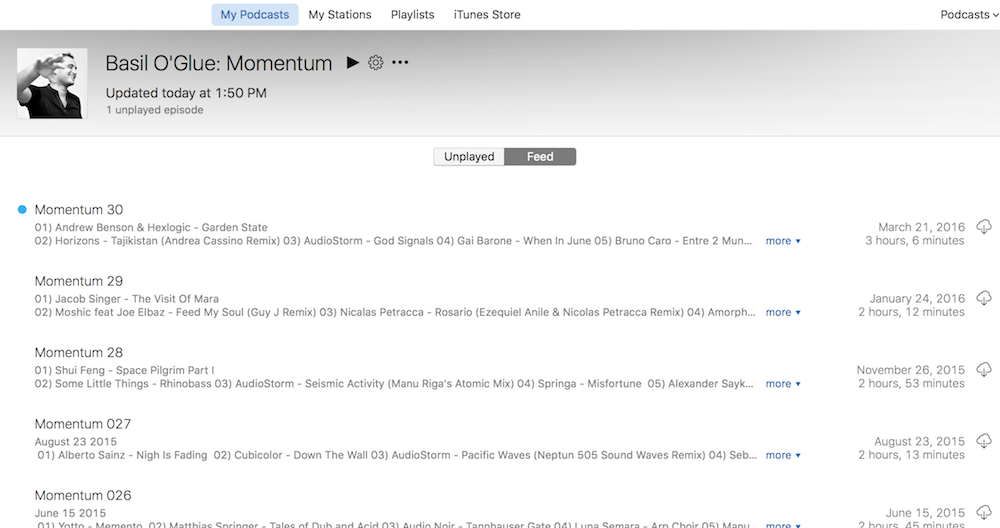
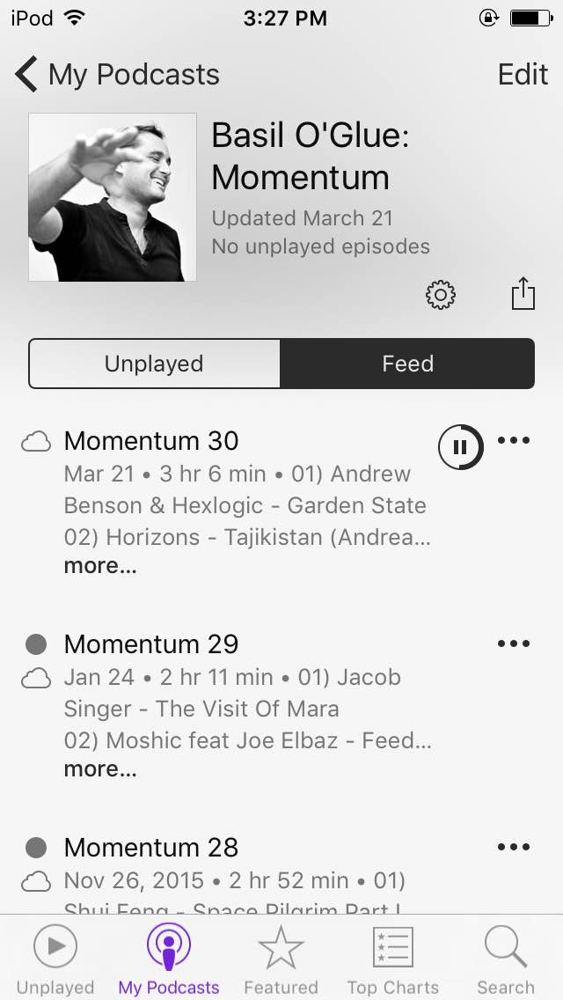
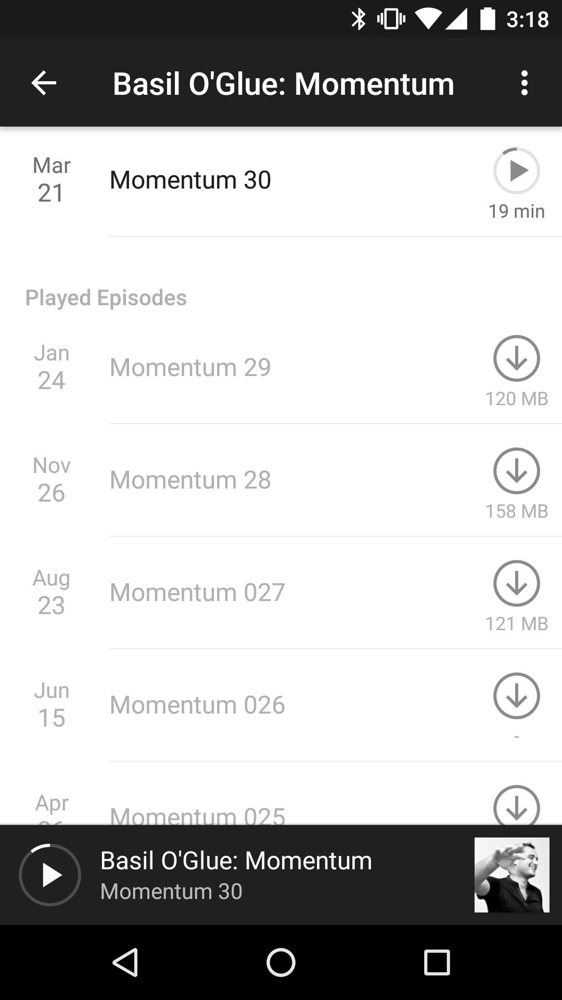

**[SoundCloud](https://soundcloud.com)** is an great website where people can upload their music and easily share it with others.

**Podcasts** are episodic series of digital media that you can subscribe to and consume at your leisure.

**[Soundcasts](https://www.soundcasts.net)** is the marriage of these two things that [Matt](https://github.com/mmedal), [Ryan](https://github.com/rtsao), and I developed.

## The Problem

[Basil O'Glue](https://soundcloud.com/basil-oglue) is an awesome electronic music artist that we love to listen to.  Every month or so he releases a 2-hour music mix called [Momentum](https://soundcloud.com/basil-oglue/mom-30).

It's a great podcast!

Or, at least it *would* be if it were a podcast.

Unfortunately, he simply posts the music onto SoundCloud and doesn't publish a podcast feed.  It's impossible to automatically download and listen to Momentum on iTunes, iOS Podcasts, Pocket Casts, or any other podcast app.

## The Solution

The solution was to make a website that takes any SoundCloud profile and converts it into a true XML podcast feed that's digestable by podcast apps.  And that's exactly what we did.  It's very simple, all you supply is:

* The artist's SoundCloud URL: `https://soundcloud.com/basil-oglue`
* The title you want for your Soundcast: `Basil O'Glue: Momentum`
* An optional filter you want to apply to track titles: `momentum`

This will return a long URL that you can add to your podcast app of choice:

  <a style="word-wrap: break-word;" href="https://api.soundcasts.net/soundcast.xml?userId=basil-oglue&title=Basil%20O'Glue%3A%20Momentum&regexString=momentum">
    https://api.soundcasts.net/soundcast.xml?userId=basil-oglue&title=Basil%20O'Glue%3A%20Momentum&regexString=momentum
  </a>

Since we added a filter, `momentum`, we will only get tracks whose titles contain "momentum" (case insensitive).

Here's what it looks like after subscribing in iTunes (`File` > `Subscribe to Podcast`):

And the iOS Podcast app:

And Pocket Casts on Android:

## Technical Details

### Server <a href="https://github.com/L33T-KR3W/soundcasts-server"><i class="ss-octocat"></i></a>

The server is a pretty simple Node.js server written using Express.  It contacts the SoundCloud API to get a list of tracks for the specified user, and then converts that list to a podcast XML feed.

The code is running on a DigitalOcean host, deployed via Dokku.  Cloudflare provides free SSL.

### Website <a href="https://github.com/L33T-KR3W/soundcasts-web"><i class="ss-octocat"></i></a>

The website is written using [Motorcycle.js](https://github.com/motorcyclejs), a derivative of [Cycle.js](https://github.com/cyclejs).  We are also using three Node.js modules that we wrote ourselves!

The code is statically hosted on GitHub Pages, with Cloudflare providing free SSL.

#### csjs <a href="https://github.com/rtsao/csjs"><i class="ss-octocat"></i></a>

CSJS an awesome library that Ryan wrote that allows you to write modular, scoped CSS with valid JavaScript.  It's very simple in its approach, but enables you to easily tackle the thorny problem of combining CSS with JavaScript components.

#### push-dir <a href="https://github.com/L33T-KR3W/push-dir"><i class="ss-octocat"></i></a>

This is a very simple library that Ryan and I wrote.  Its only purpose is to `git push` a directory you specify to a remote branch you specify.

We are using this in our Travis CI configuration; when new changes get merged into the `master` branch of our `soundcasts-web` repository, Travis CI will automatically compile the new static frontend site and `push-dir` it to our `gh-pages` branch.

#### git-credential-env <a href="https://github.com/L33T-KR3W/git-credential-env"><i class="ss-octocat"></i></a>

This is an **incredibly** simple library that Ryan and I wrote.  It allows you to register a Git credential helper that reads credentials from specified environment variables.  It's completely useless except in that it saves developers from having to understnad how Git credential helpers work: they can just copy-paste our code and have it work fine.

We use this in our Travis CI configuration to read a GitHub authentication token so that `push-dir` can authenticate when it pushes the build to `gh-pages`.
