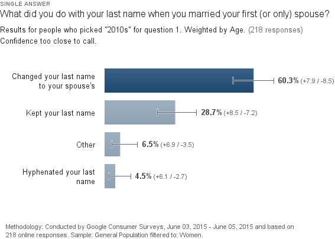

**patronymic surname**
> A patronymic surname is a surname originated from the name of the father.

The tradition of patronymic surnames in the United States is based on sexist grounds.  Therefore, the continuation of this tradition should be critically examined.

This is the result of my examination.

## The History

The tradition of wives adopting their husband's surname can be traced back to English common law, and specifically a legal doctrine called coverture.  As explained by William Blackstone in 1769:

> "By marriage, the husband and wife are one person in law: that is, the very being or legal existence of the woman is suspended during the marriage, or at least is incorporated and consolidated into that of the husband ... under the protection and influence of her husband, her baron, or lord; and her condition during her marriage is called her coverture."
> &mdash; William Blackstone, [*Of Husband and Wife*](http://lonang.com/library/reference/blackstone-commentaries-law-england/bla-115/) (1769)

In short: when husband and wife are married, wife is absorbed into husband.  One manifestation of coverture was the wife's abandonment of her own surname, and the acceptance of the husband's.

Laws in the United States no longer enforce this clear sexism, but the echos of coverture doctrine continue to strongly permeate societal expectations and outcomes...

## The Current State

[According to a survey done by the New York Times in 2015](http://www.nytimes.com/2015/06/28/upshot/about-the-maiden-name-analysis.html), about 60% of women who married from 2000&ndash;2015 changed their last names:

  
  
Ian Turner

While no data was collected for men who married during the same time period, it is obvious that there is a gender imbalance.  Given the absolute most generous interpretation, only 29% of men adopted their wife's surname; in reality, this percentage is undoubtedly lower.  Clearly, coverture doctrine still holds some traditional influence over modern marriages, even if has passed out of law.

### Yee

It is worth digressing here.  One could attempt to argue that although coverture is deplorable, the modern tradition of woman adopting man's name is pure, somehow free from that influence.

## Ethical Considerations

Because women are more often pressured and expected to adopt a man's surname and the origins of this practice are rooted in sexism, all people should be mindful of their own actions and how they perpetuate&mdash;directly or indirectly&mdash;this tradition.

I challenge the reader to consider:

* Do you want to adopt your spouse's surname?
* Do you want your spouse to adopt your surname?
* Do you think your spouse wants to adopt your surname?

## Practical Considerations

#### Personal Identity
Does your identity change when you change your surname?  How much of an adjustment is this?  Gotta ask some people who did it, or find a study.  I don't want to change my email, passport, driver's license, dozens of social accounts and logins, etc.

#### Professional Identity
Gotta ask some people who did it, or find a study.  I don't want my personal "brand" to change.

#### Divorce, Death, & Remarriage
Imagine a woman who marries (takes husband's name), divorces/widows (changes her name back), remarries (takes husband's name).

#### Inconvenience of Changing Surname
Gotta ask some people who did it, or find a study.

#### Convenience of a Family Surname
"The Hardy's" is a nice way to quickly denote 4 people.

#### Hyphenated Names
Hyphenated surnames are common and equal.  When `James Johnson` marries `Sally Smith`, we end up with either `James Johnson-Smith` and `Sally Johnson-Smith`, or `James Smith-Johnson` and `Sally Smith-Johnson`.  When `Susie Smith-Johnson` marries `Ralph Thompson-Moore`, we end up with `Susie Smith-Johnson-Thompson-Moore`.  In practice, Susie and Ralph would likely choose to drop one half of their surnames before re-combining.

#### Blended Names
Like hyphenated names but more swag

#### New Family Name
inconvenientequality.com

#### Children
If neither parent changes their surname, what surname should their offspring receive?  It would be sexist to default to either the male or female surname (as is the case in Country?). potentially inconvenient to give the children a hyphenated or blended surname.

## Personally...

* I do not expect or desire that my parter change her surname
* I do not want to change my surname
* If we have children, my preference is:
	* We would both informally (not legally, not professionally) adopt a blended surname
	* The children would receive the blended surname

## Citations

[1] Blackstone, William (1769). "Of husband and wife". Commentaries on the Laws of England (1765–1769). Lonang Institute.
